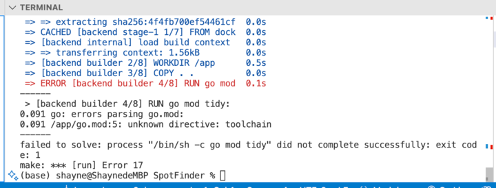

# 第一次运行：
1. 安装Docker和Docker Compose [Docker](https://docs.docker.com/get-docker/) [Docker Compose](https://docs.docker.com/compose/install/)
2. 安装Makefile
   - Windows: [Makefile](http://gnuwin32.sourceforge.net/packages/make.htm)
   - MacOS: `brew install make`
   - Linux: `sudo apt-get install make`
3. 运行 Docker或者dockerDesktop
4. 运行：
   ```shell
   make
   ```
# 第二种方法：
1. 如果Make失败了，可以尝试手动运行：
   ```shell
   docker-compose up -d
   ```
# 第三种方法：
1. 安装Go环境：
   访问Go语言的官方网站下载页面：https://golang.org/dl/
   根据您的操作系统下载相应版本的Go安装包。
   安装Go，并根据安装向导完成安装。
   安装完成后，打开命令行（Windows的CMD或PowerShell，MacOS或Linux的Terminal），输入go version来验证Go是否正确安装。
2. 配置工作空间：
   创建一个工作目录用于存放Go项目和代码（例如：~/go）。
   设置环境变量GOPATH为您的工作目录路径。同时，确保将$GOPATH/bin（Linux和MacOS）或%GOPATH%/bin（Windows）添加到您的系统环境变量PATH中。
   下载并安装项目依赖：
3. ```shell
   # in the root directory
   cd ./BackEnd/
   # 
   go mod tidy 
   go run main.go
   ```

## 异常处理：
1. 如果后端运行后显示token已过期或者token不存在：
在项目目录内，运行go build来编译项目。这将在当前目录下生成一个可执行文件。
运行编译后的可执行文件。在Linux或Mac上，可以通过./projectname来运行；在Windows上，可以直接运行projectname.exe。
如果您有Python环境：
   ```shell
   cd ./BackEnd/util/
   python3 ./quickstart.py
   ```
   为什么要用Python？因为Golang的代码会导致网页传不回来token
   如果您没有Python环境：
   ```shell
   cd ./BackEnd/util/
   docker run -it --rm --name my-running-script -v "$PWD":/usr/src/myapp -w /usr/src/myapp python:3 python ./quickstart.py
   ```
   这个代码会找到当前文件夹的credentials.json，登陆后生成一个token.json，然后就可以成功调用了。
2. Docker容器无法启动，`Is the docker daemon running?`:
   手动启动Docker Desktop
3. 如果您的Docker容器无法启动，`Error response from daemon: Conflict. The container name "/backend" is already in use by container "xxxxx". You have to remove (or rename) that container to be able to reuse that name.`:
   ```shell
   docker-compose down
   ```
   然后再重新运行
   ```shell
   docker-compose up -d
   ```
4. `go: go.mod file indicates go 1.22, but maximum version supported by tidy is 1.20`
    ```shell
    go mod edit --go=1.22
    go mod tidy
    ```
   如果报错不允许更改，则需要重新做“第三种方法”重新安装golang[安装](https://go.dev/dl/)，MacOS不需要卸载，直接安装即可
5. `go: cannot find main module; see 'go help modules'`
    ```shell
    go mod init
    go mod tidy
    ```
6. 
    重新update main branch，重新安装golang
```shell
    go mod tidy
    go run main.go
```


# 变量名字的命名规则
1. **命名开始**：变量名必须以字母（A-Z 和 a-z）或下划线（_）开始，后面可以跟任意数量的字母、数字（0-9）或下划线。
2. **驼峰命名法**：推荐使用驼峰命名法（CamelCase）来命名变量。其中，导出的变量（即可在包外访问的变量）应该使用大写字母开头的驼峰命名法（如 ExportedVariable），而非导出的变量（即只在包内部访问的变量）应使用小写字母开头的驼峰命名法（如 internalVariable）。
3. **简洁明了**：选择有意义的、能够清楚表达变量用途的名字，但同时应该尽可能简短。例如，使用 index 或 i 而不是 loopIndex，使用 customer 而不是 customerDataRecord。
4. **避免使用下划线**
5. 租车位的用户叫做`customer`，出租者叫做`host`，车位叫做`spot`，订单叫做`order`，评论叫做`comment`，评分叫做`rating`，车位图片叫做`spotImage`，用户头像叫做`avatar`，用户身份证叫做`idCard`，用户驾照叫做`driverLicense`，用户车牌照叫做`licensePlate`

# Backend
1. Redis默认开在本地6379端口，可以尝试接下来开在服务器上
2. Database开在服务器3306
3. 邮件功能调用的Google Gmail API，需要运行`quickstart.py`来登陆你的账号，然后获取`token.json`就可以成功调用了。也可以跳过这个功能，即不发送邮件，也可以用其他方法发送，验证码存放在Redis
    1. 如何调用API请看这篇文章：https://developers.google.com/gmail/api/quickstart/python
    2. 为什么要用Python？因为Golang的代码会导致网页传不回来token
    3. 为什么要用Google Gmail API 而不是SMTP？ 因为SMTP需要密码，而Google Gmail API不需要密码，只需要token.json
    ```shell
    cd ./util/
    pip install --upgrade google-api-python-client google-auth-httplib2 google-auth-oauthlib
    python ./quickstart.py
    ```
4. 数据库是什么样子的? [UserBasic.go](BackEnd%2FModels%2FUserBasic.go)
   ```go
   type CustomerBasic struct {
       gorm.Model
       Name       string     `gorm:"type:varchar(255);not null"`
       Password   string     `gorm:"type:varchar(255);not null"`
       Phone      string     `gorm:"type:varchar(20);not null"`
       DateBirth  time.Time  `gorm:"type:datetime;not null"`
       Avatar     string     `gorm:"type:mediumtext;not null"`
       Email      string     `gorm:"type:varchar(100);not null"`
       CreateTime time.Time  `gorm:"type:datetime;null"`
       DeleteTime *time.Time `gorm:"type:datetime;null"`
   
       // 用户可以有多个车辆信息，租多个车位
       CarInfo    string `gorm:"type:text;not null"` // JSON 编码的字符串
       LeasedSpot string `gorm:"type:text"`
       Addr       string `gorm:"type:text;"`
   
       // 账户余额
       Account float64 `gorm:"type:float;not null"`
       Earning float64 `gorm:"type:float;not null"`
       TopUp   float64 `gorm:"type:float;not null"`
   
       OwnedSpot string `gorm:"type:text;not null"`
   }
   
   func (CustomerBasic) TableName() string {
       return "customer"
   }
   
   type SpotBasic struct {
       gorm.Model
       ID uint `gorm:"primaryKey; autoIncrement"`
       // 一个车位只能属于一个用户
       OwnerID   uint   `gorm:"type:int;not null"`
       SpotName  string `gorm:"type:varchar(255);not null"`
       SpotAddr  string `gorm:"type:text;not null"`
       SpotType  string `gorm:"type:varchar(255);not null"`
       IsOccupy  bool   `gorm:"type:boolean;not null"`
       IsVisible bool   `gorm:"type:boolean;not null"`
       Rate      uint   `gorm:"type:int"`
       // 可以被停车的车辆类型
       Size string `gorm:"type:text;not null"`
   
       Pictures string `gorm:"type:mediumtext;not null"`
   
       PricePerDay   float64 `gorm:"type:float"`
       PricePerWeek  float64 `gorm:"type:float"`
       PricePerMonth float64 `gorm:"type:float"`
   
       // 车位被占用的时间，从久远到现在，方便用二分查找算法
       OccupiedTime string `gorm:"type:text;not null"`
   }
   
   func (SpotBasic) TableName() string {
       return "spot"
   }
   
   type OrderBasic struct {
       gorm.Model
       id uint `gorm:"primaryKey; autoIncrement"`
       // 一个订单只能属于一个用户 wwww
       OwnerID uint `gorm:"type:int;not null"`
       // 一个订单只能属于一个车位
       SpotID uint `gorm:"type:int;not null"`
       // Cost = Price * Time
       Cost float64 `gorm:"type:float;not null"`
       // Status = "Pending" or "Paid" or "Refund" or "Canceled"
       Status string `gorm:"type:varchar(255);not null"`
   }
   
   func (OrderBasic) TableName() string {
       return "order"
   }
   ```
